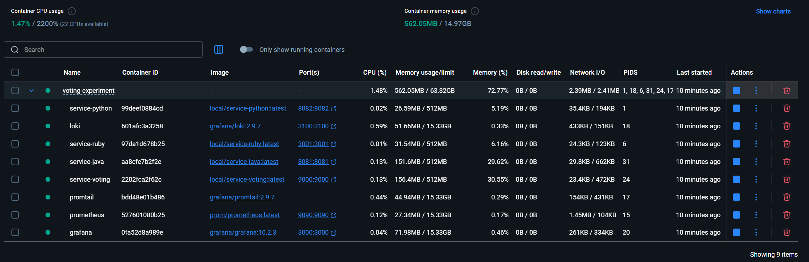
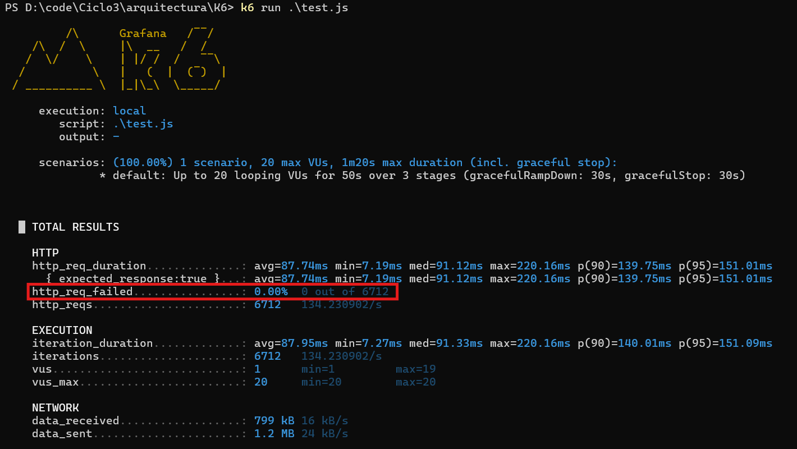
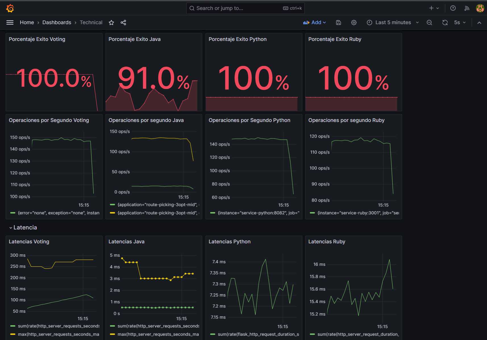

# Participación de los Integrantes

Los proyectos de este repositorio contienen la unificación de los repositorios de cada integrante del grupo :

https://github.com/NicolasInfanteUniandes96/ArquitecturasAgiles-Logistica-01.git

https://github.com/danrulloa/arquitecturasAgiles-Logistica-L02.git

https://github.com/cvillamizarL/route-picking-3opt-mid.git

https://github.com/dacruz84/ArquitecturasAgiles-Voting.git


# Como correr este proyecto?

Ejecute el sieguiente comando para poder hacer el build de las imágenes

```
docker compose -f compose.yaml build
```

Ejecute el siguiente comando para levantar todo el ecosistema
```
docker compose -f compose.yaml up -d
```

Al finalizar este comando debería ver en su docker desktop todos los contenedores arriba:




# Como ejecutar la prueba con K6?

Por favor instale K6, de acuerdo a su sistema operativo, puede seguir las instrucciones en el siguiente [link](https://grafana.com/docs/k6/latest/set-up/install-k6/#docker).

Una vez K6 esta instalado, dirijase a la carpeta `K6`, ahí encuentra un archivo con el nombre de `test.js`, por favor abra una terminal y ejecute el siguiente comando:

```
k6 run .\test.js
```

Este comando ejecutará una prueba sobre el ecosistema previamente levantado.

Particularmente se empezarán a enviar peticiones al componente voting y se podrá evidenciar que siempre responde correctamente, incluso cuando el servicio de Java tiene fallas el en 10% de las peticiones.



```
Nota:

Recuerde que el archivo de la prueba puede ser modificado para ejecutar diferentes escenarios.
```

# Cómo verificar el comportamiento de los microservicios durante la prueba?

Como parte del escositema, tenemos un contenedor de Grafana que ha sido configurado para recibir tanto los logs como las métricas.

Para usar el dashboard configurado, puede dirigirse al siguiente [link](http://localhost:3000/d/ddc8d4f2-11cd-49d7-a645-05432d7601b9/technical?orgId=1&from=now-5m&to=now&refresh=5s)

Eso lo debe llevar a una página donde podrá ver el comportamiento de cada microservicio:



De las misma manera si quiere revisar los logs de cada microservicio, puede dirigirse a este [link](http://localhost:3000/explore?schemaVersion=1&panes=%7B%22_aW%22:%7B%22datasource%22:%22loki-main%22,%22queries%22:%5B%7B%22refId%22:%22A%22,%22expr%22:%22%7Bjob%3D%5C%22service-voting%5C%22%7D%20%7C%3D%20%60%60%22,%22queryType%22:%22range%22,%22datasource%22:%7B%22type%22:%22loki%22,%22uid%22:%22loki-main%22%7D,%22editorMode%22:%22builder%22%7D%5D,%22range%22:%7B%22from%22:%22now-5m%22,%22to%22:%22now%22%7D%7D%7D&orgId=1).

# Ejecutar ataque con Zap para modificar el hash

Se incluye un contenedor OWASP ZAP que actúa como proxy para service-voting. El objetivo es simular adulteración del campo integrityHash y verificar que el PEP in-app lo detecta y reacciona.

Los scripts de manipulación de mensajes se encuentran en la carpeta zap/scripts

Para cargar el script:

curl "http://localhost:8090/JSON/script/action/load/?scriptName=tamper-hash&scriptType=httpsender&scriptEngine=ECMAScript%20:%20Graal.js&fileName=/zap/scripts/tamper-hash.js"

Para habilitar el script principal:

curl "http://localhost:8090/JSON/script/action/enable/?scriptName=tamper-hash"

Para comprobar que el script se habilitó correctamente:

"http://localhost:8090/JSON/script/view/listScripts/"

Despues de generar el hash en el frontend ClienteWeb y enviarlo al gateway, se puede consultar el log de zap para comprobar que el mensaje fue interceptado mediante el comando:

docker logs zap --tail 200

o se puede ver el log en el contenedor en el docker desktop  deberia salir algo como:

DEBUG body before: {"items":"P1,P3,P4,P6,P18,P5,P2,P11,P7,P10","integrityHash":"1e78f3a879cfcb6df9627abdffa05c21480385da2a2845697f121264782d4201"}

DEBUG body after:  {"items":"P1,P3,P4,P6,P18,P5,P2,P11,P7,P10","integrityHash":"TAMPERED_HASH_TEST"}

Para efectos de este experimento para cada request hay que habilitar el script primero.


